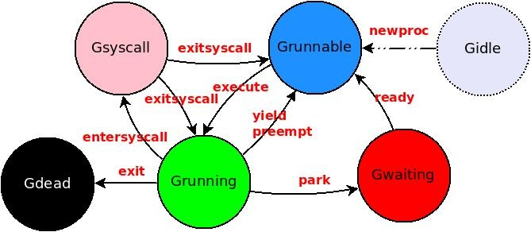
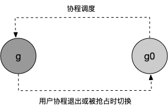

-

## 协程的生命周期与状态转移

Go运行时的调度器其实可以看成OS调度器的某种简化版 本，一个goroutine在其[生命周期](https://so.csdn.net/so/search?q=生命周期&spm=1001.2101.3001.7020)之中，同样包含了各种状态的变换。



### Gidle

协程刚开始创建时的状态，当创建的协程初始化后，会变成`_Gdead`状态，`_Gdead`状态也是协程被销毁时的状态

### Grunnable

当前协程在运行队列中，等待运行， Golang中，一个协程在以下几种情况下会被设置为 Grunnable状态：

**创建**

Go 语言中，包括用户入口函数main·main的执行goroutine在内的所有任务，都是通过runtime·newproc -> runtime·newproc1 这两个函数创建的，前者其实就是对后者的一层封装，提供可变参数支持，Go语言的go关键字最终会被编译器映射为对runtime·newproc的调用。当runtime·newproc1完成了资源的分配及初始化后，**新任务的状态会被置为Grunnable，然后被添加到当前 P 的私有任务队列中，等待调度执行。**

**阻塞任务唤醒**

当某个阻塞任务（状态为Gwaiting）的等待条件满足而被唤醒时—如一个任务G#1向某个channel写入数据将唤醒之前等待读取该channel数据的任务G#2——G#1通过调用runtime·ready将G#2状态重新置为Grunnable并添加到任务队列中。关于任务阻塞，稍后还很详细介绍。

**其他**

另外的路径是从Grunning和Gsyscall状态变换到Grunnable，我们也都合并到后面介绍。 总之，处于Grunnable的任务一定在某个任务队列中，随时等待被调度执行。

### Grunning

当前协程正在被运行，已经被分配了逻辑处理器和线程。

所有状态为Grunnable的任务都可能通过`findrunnable`函数被调度器（P&M）获取，进而通过execute函数将其状态切换到Grunning, 最后调用runtime·gogo加载其上下文并执行。

Go本质采用一种协作式调度方案，一个正在运行的任务，需要通过调用yield的方式显式让出处理器；在Go1.2之后，运行时也开始支持一定程度的任务抢占——当系统线程sysmon发现某个任务执行时间过长或者runtime判断需要进行垃圾收集时，会将任务置为”可被抢占“的，当该任务下一次函数调用时， 就会让出处理器并重新切会到Grunnable状态。关于Go1.2中抢占机制的实现细节，后面又机会再做介绍。

### Gsyscall

**代表当前协程正在被系统调用**， Go运行时为了保证高的并发性能，当会在任务执行OS系统调用前，先调用runtime·entersyscall函数将自己的状态置为Gsyscall——如果系统调用是阻塞式的或者执行过久，则将当前M与P分离——当系统调用返回后，执行线程调用runtime·exitsyscall尝试重新获取P，如果成功且当前任务没有被抢占，则将状态切回Grunning并继续执行；否则将状态置为Grunnable，等待再次被调度执行。

### Gwaiting

当前协程在运行时被锁定，不能执行用户代码，在垃圾回收以及channel通信时经常会遇到这种情况。

当一个任务需要的资源或运行条件不能被满足时，需要调用runtime·park函数进入该状态，之后除非等待条件满足，否则任务将一直处于等待状态不能执行。除了之前举过的channel的例子外，Go语言的定时器、网络IO操作都可能引起任务的阻塞。

untime·park函数包含3个参数，第一个是解锁函数指针，第二个是一个Lock指针，最后是一个字符串用以描述阻塞的原因。 很明显，前两个参数是配对的结构——由于任务阻塞前可能获得了某些Lock，这些Lock必须在任务状态保存完成后才能释放，以避免数据竞争。我们知道channel必须通过Lock确保互斥访问，一个阻塞的任务G#1需要将自己放到channel的等待队列中，如果在完成上下文保存前就释放了Lock，则可能导致G#2将未知状态的G#1置为Grunnable，因此释放Lock必须在runtime·park内完成。 由于阻塞时任务持有的Lock类型不尽相同——如Select操作的锁实际上是一组Lock的集合——因此需要特别指出Unlock的具体方式。 最后一个参数主要是在gdb调试的时候方便发现任务阻塞的原因。 顺便说一下，当所有的任务都处于Gwaiting状态时，也就表示当前程序进入了死锁态，不可能继续执行了，那么runtime会检测到这种情况，并输出所有Gwaiting任务的backtrace信息。

### Gdead

最后，当一个任务执行结束后，会调用runtime·goexit结束自己的生命——将状态置为Gdead，并将结构体链到一个属于当前P的空闲G链表中，以备后续使用。

Go语言的并发模型基本上遵照了CSP模型，goroutine间完全靠channel通信，没有像Unix进程的wait或waitpid的等待机制，也没有类似“POSIX Thread”中的pthread_join的汇合机制，更没有像kill或signal这类的中断机制。每个goroutine结束后就自行退出销毁，不留一丝痕迹。

[参考链接](https://blog.csdn.net/fish_study_csdn/article/details/123100245)

## 特殊协程g0与协程

一般协程有main协程与子协程，main协程在整个程序中只有一个，每个线程中都有一个特殊的协程g0

```go
type m struct {
	g0 *g 	//goroutine with scheduling stack]
 	...
}
```

协程g0运行在操作系统线程栈上，主要是执**行协程调度的一系列运行时代码**，而一般的协程无差别地用于执行用户代码。很显然 **执行用户代码的任何协程都不适合进行全局调度**。

在用户协程退出或被抢占时，意味着需要重新执行协程调度，这时需要从用户协程g 切换到协程g0，协程g与协程g0的对应关系如下图。

注意：每个线程的内部都在完成这样的切换与调度循环




